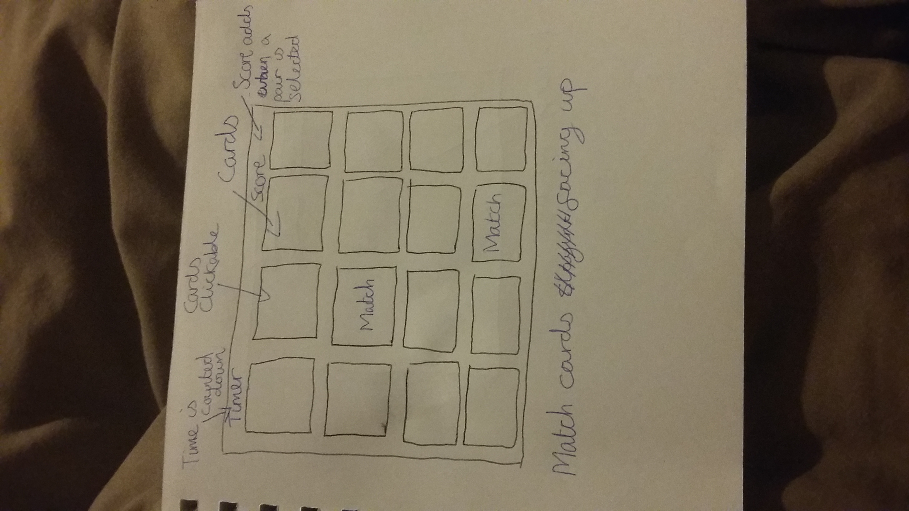
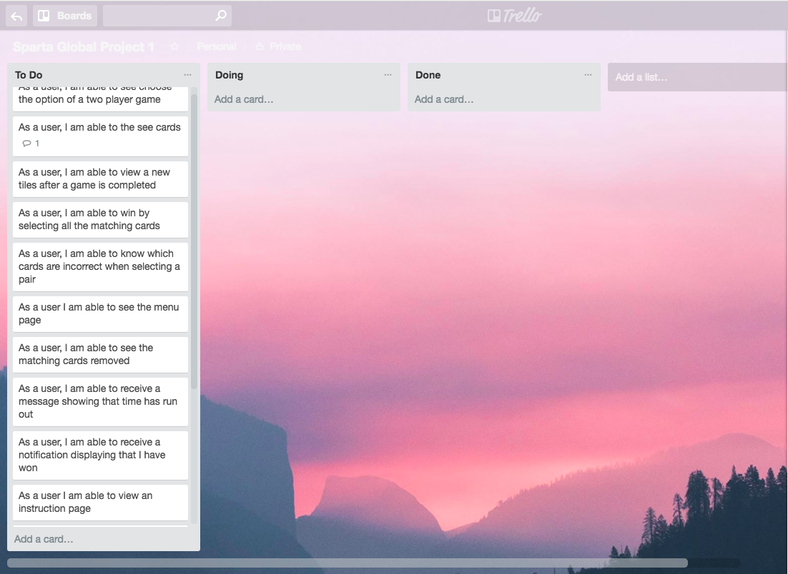
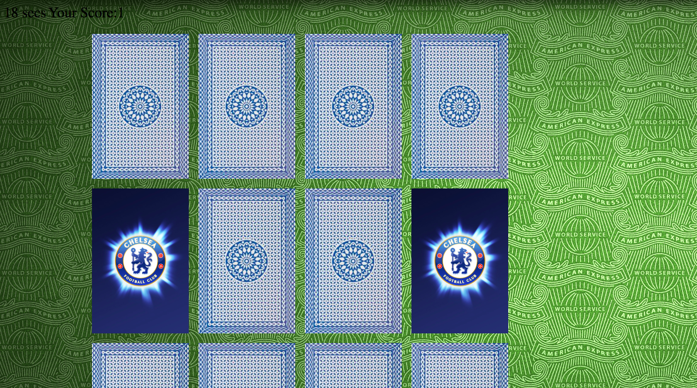

# Sparta-Global-Project1

Matching card games

## Table of Contents

Code Snippets

- The Software
- Task Requirements
- How to download and play
- Aim of the game
- Stages
- Sprint 1

  - Planning
  - Wireframe
  - Issues
  - Images
  - User Stories
  - Acceptance Criteria

- Sprint 2

  - What I Found Difficult
  - Successes

- Website Results

### Code Snippets

`$(document).ready(function() { //When the page loads`

`var cards = document.getElementsByClassName("card"); //The variable cards gets the class name "cards" where the list in the HTML where the class names will be stored in`

`var array = [];`

`var score = 0;`

`var count;`

`Fisher-yates shuffle method function shuffle(array) { var currentIndex = array.length, temporaryValue, randomIndex; //Gets the current array`

`// While there remain elements to shuffle... while (0 !== currentIndex) { //While the array is not equalled to zero it goes through the array`

### Task Requirements

Was to build a browser based game that should be built using html, css and JavaScript

#### Important Requirements

- Include an instruction section explaining how to play the game.
- Ether display a message when the user has won or display the users score after the game has finished.
- Be styled to perfection!
- Be hosted online!

### The Software

This game built using HTML, CSS and Javascript.

### How to download and play

Run the file by accessing the link <https://github.com/JamesBuabin14/sparta-global-project1/> then select solo play to begin or select the the clone or download button and download zip file. Once the file is downloaded open the file **index.html** file in your browser.

## Aim of the game

I decided to build a matching card game as it is easy to play and can be played by children or adults with multiple people. Something that requires observation, concentration and a good memory to win. The player has to find all the matching cards by selecting a card which is randomly positioned before the time runs out.

## Sprint 1

### Wireframe

Beginning my idea I drafted my image on paper to get an understanding of what my game will look like

   

### Issues

Approaching sprint 1 I came across issues trying making the cards be positioned randomly. In order for the game to have random positioning I needed to have placed an algorithm that switch cards around every time the page loads. At the time I had no experience with algorithms however it was the only way to get the feature to work so I used the Fisher-yates shuffle algorithm.

```function shuffle(array) { var currentIndex = array.length, temporaryValue, randomIndex; //Gets the current array

`// While there remain elements to shuffle... while (0 !== currentIndex) { //While the array is not equalled to zero it goes through the array`

`// Pick a remaining element... randomIndex = Math.floor(Math.random() * currentIndex); currentIndex -= 1; //Generates a random number each time the loop passes and saves in the current index`

`// And swap it with the current element. temporaryValue = array[currentIndex]; //Gets the current index position stores in temporary value array[currentIndex] = array[randomIndex]; //The position of the random number is grabbed by the array of the current position array[randomIndex] = temporaryValue; //This switches the current index position with the array position }`

`return array; //restores the card position back to the array }`

### User Stories

On the website Trello I create stories to understand and work towards completing an mvp (minimal viable product) helping me think of what actions to take when list the features. When using Trello I would drag the message boxes if they were in progress or if they were completed.

Whilst using Trello I made sure that I worked in order of priority creating the main the tasks first the any bonus features later on.



### Acceptance Criteria

My acceptance criteria was built around if it had the main things for a matching card game from score, pairing cards, timer, winner or loser functioning and displayed in a grid. I would have liked all user stories to be complete even though they were at a low priority.

## Sprint 2

### What I found difficult

#### Matching the cards

Matching the cards became quite troublesome as of thinking of a way to pair the selected cards. I overcame this problem by setting the cards with an id (of the 1st and 2nd position of the array) once they are click. I create statements if they are selected display the card face image representing them as the correct pair.

#### Rearranging the card positions

As stated before I had to use an algorithm in order to reposition cards that were in the array. I did some research and discovered the Fisher-yates shuffle algorithm which is a common way of switching array elements in random positions.

#### Incorrect cards flip back

If the cards were not correct they would suddenly disappear so I had to think of a way of making them flip back. I made an if statement that if the array positions did not match then it would display an image of the back of the card which I applied to all the selected cards.

### Successes

I am most of proud of the cards being shuffled and being able to match or not match to the corresponding card. The first attempt taking a look at other examples online however their code was very completed to understand. So I broke it down into small steps gradually getting the feature to be in action.

## Website Results

   
